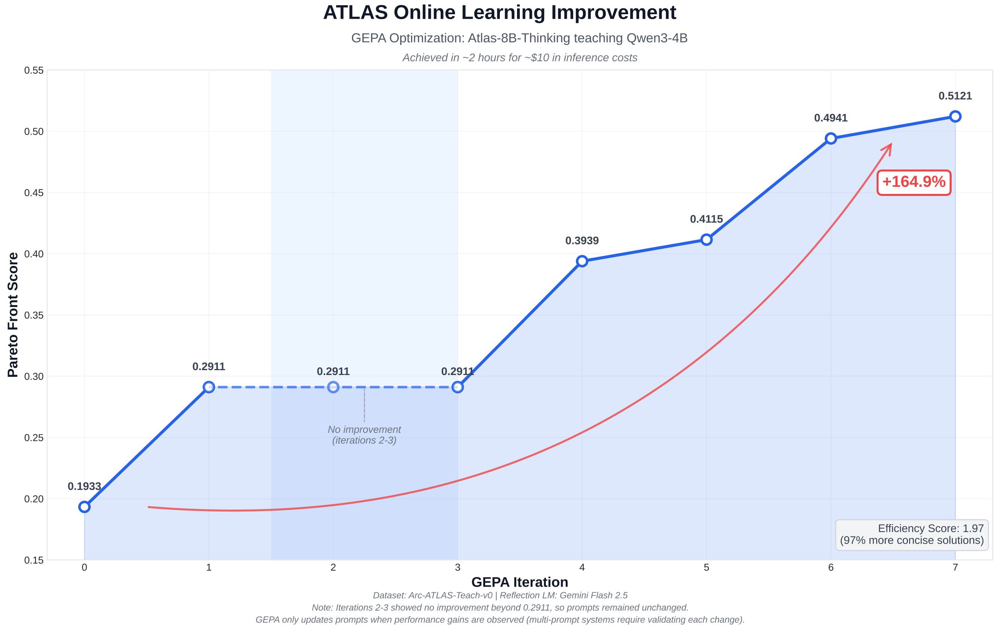

# ATLAS: A Hybrid RL Architecture for Compounding Intelligence

<p align="center">
  <b>Hybrid offline RL + online optimization for adaptive teacher agents. Enterprise-ready, fast to deploy, and developer-friendly.</b>
</p>

<div align="center">

[](https://huggingface.co/Arc-Intelligence/ATLAS-8B-Thinking)
[](https://huggingface.co/Arc-Intelligence/ATLAS-8B-Instruct)
[](https://huggingface.co/datasets/Arc-Intelligence/Arc-ATLAS-Teach-v0)


</div>

---

ATLAS is a hybrid learning architecture that separates complex, data-intensive offline training from lightweight, production-safe online deployment. This approach creates **Compounding Intelligence**, where agents build deep, foundational skills through rigorous offline reinforcement learning (RL) and then rapidly adapt to live data in production.

📄 **[Read the ATLAS Technical Report](docs/ATLAS-Technical-Report.pdf)** for comprehensive methodology, ablation studies, and detailed performance analysis.

---

## The ATLAS Hybrid Learning Architecture

<details open>
<summary><strong>Part 1: Offline Foundation — Building Generalizable Skills</strong></summary>

The foundation of ATLAS is a unique, pedagogically-informed offline RL framework that instills deep, foundational knowledge into "Teacher" agents. This process creates robust, transferable skills that generalize across domains.

Our foundational research proved this works: **an agent taught a single foundational skill becomes ~6x better at performing a completely unrelated, complex enterprise task.**

This robust foundation delivers consistent and reliable performance improvements across student models:

<div align="center">

</div>

| Metric                | Teacher+Student | Student Alone | Improvement | 
| --------------------- | --------------- | ------------- | ----------- | 
| **Average accuracy**  | +15.7%          | baseline      | **+15.7%**  | 
| **Maximum improvement** | +29.6%          | -             | **+29.6%**  | 
| **Completion rate**   | ~100%           | ~69%          | **+31%**    | 
| **Response efficiency** | ~2k tokens      | ~4k tokens    | **-50%**    | 

</details>

<details open>
<summary><strong>Part 2: Online Optimization — Amplifying Value in Production</strong></summary>

We supercharge these powerful foundation models in production with a hyper-efficient online loop. Using a process called **reflective mutation**, ATLAS automates reward engineering and adapts to live data safely and efficiently. This allows us to pre-train "Teacher" models that solve the cold-start problem for new tasks and customers.

The results are dramatic: our ATLAS-8B-Thinking model showed a **165% performance gain in just 2 hours of online optimization.**



- **~2 hours** total optimization time
- **~$10** in inference costs using `gemini/gemini-flash-2.5`
- **1.97 efficiency score**, producing solutions 97% more concise than the baseline

For configuration walkthroughs, explore the [Online Learning Guide](docs/guides/online-learning.md) and additional references in `docs/guides/` such as [Model Selection](docs/guides/model-selection.md) and [Distributed Training](docs/guides/distributed-training.md).

</details>

---

## Getting Started: Choose Your Path

<details open>
<summary><strong>Paths to Production</strong></summary>

### Path A: Deploy & Optimize Immediately (Low-Friction)

Leverage our pre-trained models to get value now. This path uses the online optimization loop to adapt a powerful Teacher model to your specific tasks.

1.  **Optimize ATLAS Prompts:**
    Use this command to run the online optimization pipeline with the default Teacher and Student models.
    ```bash
    python optimize_teaching.py --config configs/optimize/default.yaml
    ```

2.  **Wrap Your Own Agent:**
    This script wraps an existing agent (e.g., an OpenAI Assistant or custom API) in the ATLAS teaching framework for optimization.
    ```bash
    scripts/openai_agent_atlas.sh configs/wrappers/openai_existing_agent.yaml
    ```
*Set provider credentials (e.g., `OPENAI_API_KEY`, `GEMINI_API_KEY`), ensure Python 3.11 is active, and install deps via `requirements-py311.txt` (or LiteLLM configs if swapping models). For full configuration details, see the [Online Learning Guide](docs/guides/online-learning.md).*

*Related guides: [Model Selection](docs/guides/model-selection.md), [Distributed Training](docs/guides/distributed-training.md), [RL Training](docs/guides/rl-training.md).*

### Path B: Build a Custom Foundation (Advanced)

For advanced users who want to perform the full offline RL training to create a custom Teacher model.

1.  **SFT Warmup (1 epoch):**
    ```bash
    scripts/launch.sh 1 configs/run/teacher_sft.yaml report_to=null save_final_model=false num_train_epochs=1
    ```

2.  **RL Training with vLLM (4 steps):**
    ```bash
    scripts/launch_with_server.sh 1 1 configs/run/teacher_rcl.yaml report_to=null max_steps=4 eval_steps=1
    ```
*This is a minimal smoke test. For full instructions on multi-GPU setup and production training, see the [Training Pipeline Details](#training-pipeline-details) and the [RL Training Guide](docs/guides/rl-training.md).*

</details>

---

## Installation

<details open>
<summary><strong>Environment Setup</strong></summary>

Conda is recommended for environment management. The repository has been validated with Python 3.11 and 3.12.

**Python 3.11:**
```sh
bash scripts/install_py311.sh
```

**Python 3.12:**
```sh
bash scripts/install_py312.sh
```

</details>

---

## Core Concepts

<details open>
<summary><strong>Key Ideas</strong></summary>

- **Teacher-Student Architecture**: ATLAS trains "teacher" models that can assess any "student" model's capability and provide conditional guidance to maximize performance.
- **Diagnostic Probing**: Teachers assess student understanding through minimal interaction (≤50 tokens) before providing guidance, enabling capability-adapted teaching.
- **Adaptive Teaching**: Based on diagnosed capability, teachers provide targeted instruction—minimal intervention for strong students, comprehensive scaffolding for weak students.
- **Training Methodology**: A two-phase SFT→RL pipeline where teachers learn optimal teaching strategies through reward signals based on student performance and efficiency.

<div align="center">

</div>

</details>

---

## Training Pipeline Details

<details open>
<summary><strong>Offline RL Workflow</strong></summary>

ATLAS uses a two-phase SFT→RL pipeline managed via [Hydra](https://hydra.cc/) configs. Training is scalable from a single GPU to distributed setups with DeepSpeed.

A full production training run on 8×H100 infrastructure looks like this:

```sh
# Phase 1: SFT Warmup
scripts/launch.sh 8 configs/run/teacher_sft.yaml output_dir=path/to/save/pre_rl_model

# Phase 2: RL Training (2-3 days)
scripts/launch_with_server.sh 4 4 configs/run/teacher_rcl.yaml \
  model_name_or_path=path/of/saved/pre_rl_model
```

- See [docs/guides/distributed-training.md](docs/guides/distributed-training.md) for multi-GPU setup.
- See [docs/guides/rl-training.md](docs/guides/rl-training.md) for detailed RL parameters.
- See [docs/guides/data-requirements.md](docs/guides/data-requirements.md) for custom dataset specifications.

<div align="center">

</div>

</details>

---

## Project Structure & Configs

<details open>
<summary><strong>Repo Layout</strong></summary>

- `train.py`: Main entry point for all experiments.
- `configs/`: Modular Hydra configurations.
- `trainers/`: Core training logic including GRPO, teacher rewards, and vLLM integration.
- `custom_data/`: Dataset handlers and formatting.
- `scripts/`: Installation and utility scripts.

</details>

---

## Troubleshooting

<details open>
<summary><strong>Common Issues</strong></summary>

Server health can be verified with `curl http://$vllm_host:$vllm_port/health`. Port conflicts can be resolved by setting `vllm_port`. Authentication errors typically require `huggingface-cli login`. Memory issues can be addressed by adding `offload` to commands or reducing `per_device_train_batch_size`.

For comprehensive troubleshooting, see the [docs/](docs/).

</details>

---

## Citation

```bibtex
@article{atlas2025,
  title     = {ATLAS: A Hybrid RL Architecture for Compounding Intelligence},
  author    = {Arc Intelligence},
  journal   = {arXiv preprint},
  year      = {2025}
}
```
