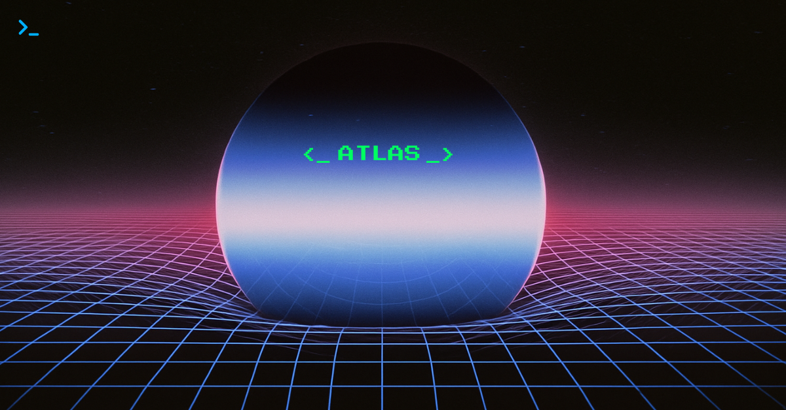
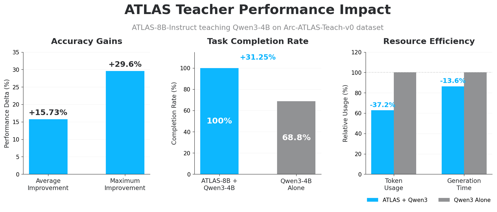
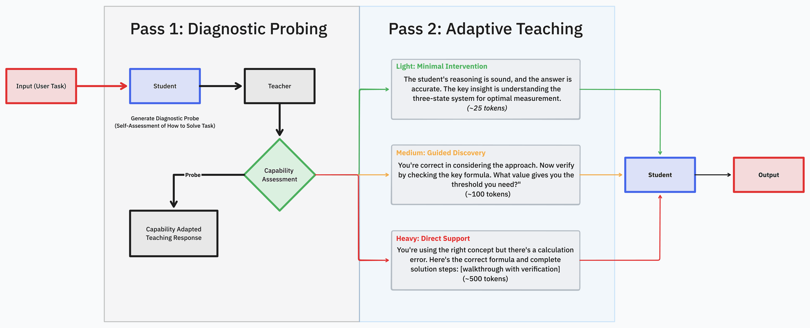
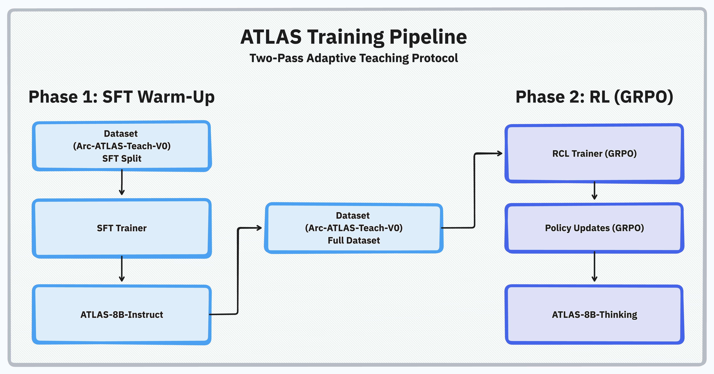

# ATLAS: Adaptive Training Methodology for RL

> A diagnostic teaching approach that delivers consistent performance improvements in reinforcement learning training pipelines.

<p align="center">
  <b>Adaptive Teaching and Learning Alignment System for Agents</b>
</p>

<div align="center">

[](https://huggingface.co/Arc-Intelligence/ATLAS-8B-Thinking)
[](https://huggingface.co/Arc-Intelligence/ATLAS-8B-Instruct)
[](https://huggingface.co/datasets/Arc-Intelligence/Arc-ATLAS-Teach-v0)



</div>

---

ATLAS delivers consistent **15.7% accuracy improvements** and **31% completion gains** across any base model through diagnostic probing and conditional teaching. The framework works with **any student model (open or closed source)** — train your own teacher or use our pre-trained **[ATLAS-8B-Thinking](https://huggingface.co/Arc-Intelligence/ATLAS-8B-Thinking)** and **[ATLAS-8B-Instruct](https://huggingface.co/Arc-Intelligence/ATLAS-8B-Instruct)** models.

## Student Performance Results

Our evaluation demonstrates that ATLAS-trained teachers consistently improve student model performance across multiple metrics with verified reliability.

<div align="center">

</div>

<div align="center">

| Metric | Teacher+Student | Student Alone | Improvement |
|--------|----------------|---------------|-------------|
| **Average accuracy** | +15.7% | baseline | **+15.7%** |
| **Maximum improvement** | +29.6% | - | **+29.6%** |
| **Completion rate** | ~100% | ~69% | **+31%** |
| **Response efficiency** | ~2k tokens | ~4k tokens | **-50%** |
| **Generation time** | ~1:10 | ~1:21 | **-13.6%** |

</div>

The system achieves a 97% non-degradation rate with consistent improvements across problem difficulty levels. The framework includes the complete ATLAS training pipeline with SFT to RL workflow using GRPO optimization, the adaptive teaching protocol implementing two-pass diagnostic probing with conditional teaching, production-ready vLLM server architecture with distributed training support, and pre-trained [ATLAS-8B-Thinking](https://huggingface.co/Arc-Intelligence/ATLAS-8B-Thinking) and [ATLAS-8B-Instruct](https://huggingface.co/Arc-Intelligence/ATLAS-8B-Instruct) teacher models with Arc-ATLAS teaching datasets.

---

## Adaptive Teaching Protocol

The protocol achieves reliable performance improvements through diagnostic probing followed by capability-adapted teaching.

<div align="center">

</div>

The protocol operates in two phases. First, diagnostic probing allows the teacher to assess student understanding through minimal interaction (≤50 tokens), revealing capability levels without requiring complete solutions. Second, adaptive teaching provides conditional guidance tailored to the diagnosed capability—strong students receive minimal intervention to avoid degradation while weak students receive comprehensive scaffolding and support. The reward system assigns zero reward for performance degradation and positive rewards for improvements with efficiency bonuses, encouraging helpful teaching while preventing harmful interventions.

This adaptive teaching system serves as the foundation for our broader Compound Intelligence framework, which combines persistent memory with online learning loops for continuously improving agent systems.

---

<div align="center">

</div>

---

## Quickstart

Run minimal smoke tests on a single GPU to validate your setup.

**SFT warmup (1 epoch):**

```bash
scripts/launch.sh 1 configs/run/teacher_sft.yaml report_to=null save_final_model=false num_train_epochs=1
```

**RL with vLLM (4 steps):**

```bash
scripts/launch_with_server.sh 1 1 configs/run/teacher_rcl.yaml report_to=null max_steps=4 eval_steps=1
```

The `teacher_rcl.yaml` configuration uses `use_vllm_server: true` by default, while `launch_with_server.sh` handles `vllm_host` setup and `vllm_port` validation. Adding `offload` to commands reduces GPU memory usage.

---

## Installation

Conda is recommended for environment management. The repository and models have been validated with Python 3.11 and Python 3.12. Use the appropriate installation script to replicate the environment:

**Python 3.11:**
```sh
scripts/install_py311.sh
```

**Python 3.12:**
```sh
scripts/install_py312.sh
```

Otherwise, you can install all our dependencies in your own custom environment:

```sh
python -m pip install torch==2.6.0 --index-url https://download.pytorch.org/whl/cu124
python -m pip install vllm==0.8.3 tensorboard
python -m pip install flash-attn --no-build-isolation
python -m pip install flashinfer-python -i https://flashinfer.ai/whl/cu124/torch2.6/

python -m pip install --upgrade -r requirements-py311.txt  # or requirements-py312.txt
```

## Training Pipeline

RCL uses a two-phase SFT→RL pipeline managed via [Hydra](https://hydra.cc/) configs. Training is scalable from single GPU to distributed setups with DeepSpeed.

Basic training follows a two-phase approach:

```sh
# SFT training
scripts/launch.sh ${NUM_OF_GPUS} configs/run/teacher_sft.yaml ${hydra_args}

# RL training with vLLM server
scripts/launch_with_server.sh ${NUM_VLLM_GPUS} ${NUM_TRAINING_GPUS} configs/run/teacher_rcl.yaml ${hydra_args}
```

Key parameters include `degradation_penalty_multiplier`, `dataset_id_or_path`, and `model_name_or_path`. Memory optimization can be achieved by adding `offload` to commands. All results are saved to `results/`.

See [docs/guides/distributed-training.md](docs/guides/) for multi-GPU setup and [docs/guides/rl-training.md](docs/guides/) for detailed RL parameters.

Production training on 8×H100 infrastructure:

```sh
# Phase 1: SFT Warmup
scripts/launch.sh 8 configs/run/teacher_sft.yaml output_dir=path/to/save/pre_rl_model

# Phase 2: RL Training (2-3 days)
scripts/launch_with_server.sh 4 4 configs/run/teacher_rcl.yaml \
  model_name_or_path=path/of/saved/pre_rl_model
```

The system defaults to the [ATLAS-8B-Thinking](https://huggingface.co/Arc-Intelligence/ATLAS-8B-Thinking) teacher model with `Arc-Intelligence/Arc-ATLAS-Teach-v0` for both SFT and RL phases. Custom datasets require `question` and `solution` columns. Detailed formatting specifications are available in [docs/guides/data-requirements.md](docs/guides/).

See [docs/concepts/adaptive-teaching.md](docs/concepts/) for detailed protocol and reward design.

### Learning Metrics

The framework introduces specialized metrics for measuring learning effectiveness: Learning Rate (LR) captures performance change per interaction, Non-Degradation Rate (NDR) measures interactions that maintain or improve performance with a target of ≥99%, and Teaching Efficiency Score (TES) quantifies performance gain per teaching token.

Student training utilizes adaptive teaching outputs with automatic complexity adjustment based on model size. Complete evaluation protocols are documented in [docs/concepts/evaluation.md](docs/concepts/). Access to models and datasets requires `huggingface-cli login`. W&B logging can be disabled by setting `report_to: null`. Setup details are available in [docs/getting-started/](docs/getting-started/).

## Concepts

RCL implements an outer loop architecture for Compound Intelligence. The two-phase SFT→RL training using GRPO creates teachers that diagnose student capability and provide adaptive teaching without harmful interventions, forming the foundation for persistent, continuously learning agent systems.

ATLAS (Adaptive Teaching and Learning Alignment System) encompasses the teacher model family and inference pipeline implementing the Arc-ATLAS datasets. The system employs a two-pass inference protocol that first probes student understanding, then delivers conditional teaching based on diagnosed capability.

vLLM integration provides FastAPI server endpoints (`/health`, `/generate`, `/init_communicator`) with client wiring into GRPO and Teacher trainers. Architectural details are documented in [docs/architecture/](docs/architecture/).

Hydra configurations enable modular experiment design through `train.py` as the entry point, with outputs saved under `results/`. The configuration system supports flexible building blocks for experimental variation.

## Config System

Run recipes in `configs/run/*.yaml` contain complete experiment configurations built from modular components in `configs/{data,model,trainer}/`. Common parameter overrides include `dataset_id_or_path=my/custom/dataset` and `model_name_or_path=my/base/model`.

Reward configuration through `configs/trainer/reward/adaptive_teaching.yaml` controls teaching behavior via `degradation_penalty_multiplier`, `efficiency_weight`, and probe token limits. Detailed reward design principles are documented in [docs/concepts/](docs/concepts/).

## Project Structure

- `train.py`: Main entry point for all experiments
- `configs/`: Modular Hydra configurations (run recipes, data, models, trainers)
- `accelerate/`: DeepSpeed configurations (zero1, zero3, cpu offloading)
- `trainers/`: Core training logic including GRPO, teacher rewards, vLLM integration
- `custom_data/`: Dataset handlers and formatting (see `datasets_info.py`)
- `scripts/`: Installation and utility scripts
- `scripts/launch.sh`, `scripts/launch_with_server.sh`: Shell entry points for single and distributed training

## Troubleshooting

Server health can be verified with `curl http://$vllm_host:$vllm_port/health`. Port conflicts can be resolved by setting `vllm_port=8766` if the default 8765 is occupied. Authentication errors typically require running `huggingface-cli login`. Memory issues can be addressed by adding `offload` to commands, reducing `per_device_train_batch_size`, or using `accelerate/deepspeed_zero1.yaml`.

For comprehensive troubleshooting, installation guides, and deployment instructions, see [docs/](docs/).

## Status & Roadmap

The current stable implementation includes ATLAS SFT+RL training, vLLM server integration, and the Hydra configuration system. Future development toward the full Compound Intelligence framework will incorporate persistent organizational memory, online learning loops, and cross-agent knowledge transfer, with ATLAS serving as the foundational outer loop training component for continuously learning agent systems.

Results can be reproduced using:
```bash
# SFT Warmup  
scripts/launch.sh 4 configs/run/teacher_sft.yaml dataset_id_or_path=Arc-Intelligence/Arc-ATLAS-Teach-v0

# RL Training
scripts/launch_with_server.sh 1 3 configs/run/teacher_rcl.yaml \
  model_name_or_path=results/pre_rl_model \
  dataset_id_or_path=Arc-Intelligence/Arc-ATLAS-Teach-v0 num_generations=32
```

**Environment**: 4×H100 GPUs, [Arc-Intelligence/Arc-ATLAS-Teach-v0](https://huggingface.co/datasets/Arc-Intelligence/Arc-ATLAS-Teach-v0) dataset, seed=42  
**Models**: [ATLAS-8B-Thinking](https://huggingface.co/Arc-Intelligence/ATLAS-8B-Thinking), [ATLAS-8B-Instruct](https://huggingface.co/Arc-Intelligence/ATLAS-8B-Instruct)

See [docs/benchmarks/](docs/benchmarks/) for complete methodology and detailed performance analysis.

## Citation

If you find our work or this repository useful and want to cite our work, you can use the following:

```bibtex
@article{rcl2025,
  title     = {Reinforcement Collaborative Learning: Adaptive Teaching at Scale},
  author    = {Author Names},
  journal   = {arXiv preprint},
  year      = {2025}
}
```
