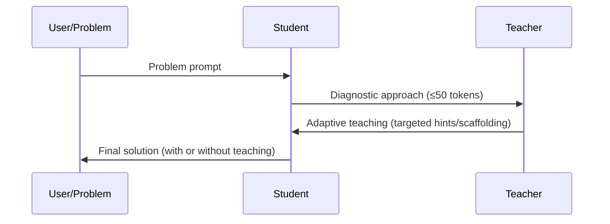

# Two-Pass Protocol

RCL uses a two-pass protocol per example:

1) Probe the student’s capability with a ≤50-token diagnostic.
2) Generate adaptive teaching conditioned on the probe.

In training, GRPO optimizes the teacher using rewards from `AdaptiveTeachingReward`, comparing student performance with and without the teacher’s intervention.

